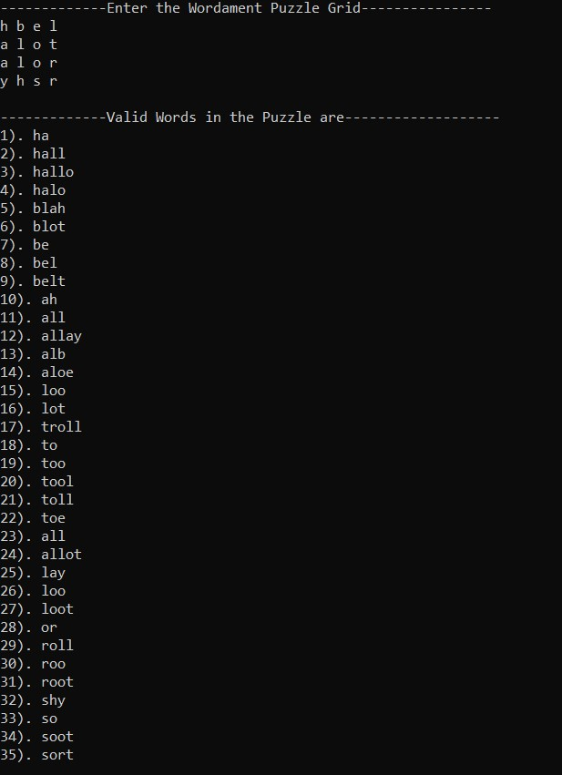

# Microsoft-Wordament-solver
## What it does?
* Microsoft Wordament is a game in which we need to return all the valid words from the puzzle(Matrix). So for solving this puzzle efficiently, developed an interface which takes the puzzle as input and returns all the valid words from that puzzle.
* Used Trie in C++, DFS algorithm and some basic file handling.
## How To start? ⁉
* We have to provide 4x4 input matrix consisting lower case alphabets only including spaces.
* For example: 
    h b e l  
    a l o t  
    a l o r  
    y h s r  
* After giving input in above format we will get the valid words which found in that matrix as below.

